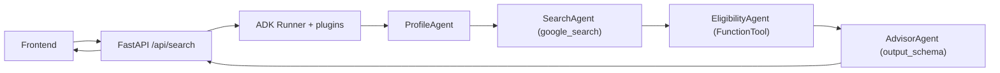

# SCHOLY AGENT

Sistema **multiagente** construido con el **Google Agent Development Kit (ADK)**
que ayuda a estudiantes a encontrar las becas universitarias que mejor se alinean
con su perfil (nivel académico, área, país, idioma, nacionalidad y finanzas), y
les explica el **encaje financiero** de cada opción.

Proyecto final del *5-Day AI Agents Intensive Course with Google*.

---

## 1. El problema

Buscar becas es lento, confuso y disperso: la información está repartida en
cientos de sitios, con requisitos distintos (nivel, idioma, nacionalidad, GPA) y,
lo más importante, **una beca "encontrada" no siempre es viable**: muchas cubren
solo la matrícula y dejan por fuera vivienda, comida y transporte en otro país.

## 2. La solución y por qué agentes

Un único prompt no resuelve bien una tarea con varias etapas heterogéneas
(entender al usuario → buscar en la web → filtrar por reglas → aconsejar). Un
**equipo de agentes especializados** sí: cada uno hace una cosa bien, es
mantenible y auditable. SCHOLY usa cuatro agentes en un pipeline secuencial:

| Agente | Qué hace |
| --- | --- |
| **ProfileAgent** | Normaliza y valida el perfil del estudiante. |
| **SearchAgent** | Busca becas reales en internet con `google_search` (grounding). |
| **EligibilityAgent** | Filtra por elegibilidad y puntúa con una herramienta determinista. |
| **AdvisorAgent** | Entrega la recomendación final + análisis financiero (JSON estructurado). |

## 3. Arquitectura



El estado fluye entre agentes con `output_key` → `{clave}`:
`student_profile` → `raw_scholarships` → `eligible_scholarships` → `final_recommendation`.

Detalle completo en [docs/architecture.md](docs/architecture.md).

## 4. Estructura del proyecto

```
scholy-agent/
├─ scholy/                  # Paquete del sistema multiagente (ADK)
│  ├─ agent.py              # root_agent (SequentialAgent) -> entrypoint ADK
│  ├─ config.py             # Configuración desde entorno (cero secretos en código)
│  ├─ llm.py                # Fábrica del modelo Gemini (compartida)
│  ├─ schemas.py            # Modelos pydantic (StudentProfile, Scholarship, Recommendation)
│  ├─ observability.py      # Logging + plugins de métricas (Agent Ops)
│  ├─ agents/               # ProfileAgent, SearchAgent, EligibilityAgent, AdvisorAgent
│  ├─ tools/                # FunctionTool de compatibilidad + conector MCP (V2)
│  └─ security/             # Guardrails deterministas + SecurityGuardrailPlugin
├─ server/main.py           # Backend FastAPI (API + sirve el frontend)
├─ frontend/                # UI minimalista (HTML + Tailwind CDN + JS vanilla)
├─ docs/architecture.md     # Diagramas y decisiones de diseño
├─ AGENTS.md                # Constitución/harness del sistema
├─ requirements.txt
├─ .env.example             # Plantilla de variables (copiar a .env)
└─ .gitignore
```

## 5. Setup (local, gratis)

Requisitos: Python 3.11+ y una API key gratuita de Google AI Studio.

```bash
# 1. Entorno virtual
python -m venv .venv
.venv\Scripts\activate          # Windows (PowerShell)
# source .venv/bin/activate      # macOS / Linux

# 2. Dependencias
pip install -r requirements.txt

# 3. Credenciales
copy .env.example .env           # Windows  (cp en macOS/Linux)
# Edita .env y pega tu GOOGLE_API_KEY  (https://aistudio.google.com/apikey)
```

> El MVP corre **100% gratis** con la capa gratuita de Gemini. `google_search`
> (grounding) funciona dentro de esa capa, con límites de cuota.

## 6. Ejecutar

**Opción A - Aplicación web (recomendada):**

```bash
uvicorn server.main:app --reload --port 8000
# Abre http://localhost:8000
```

**Opción B - UI de desarrollo del ADK (útil para ver traces en el demo):**

```bash
adk web            # ejecútalo en la carpeta que contiene el paquete "scholy"
# adk web --log_level DEBUG   # para inspeccionar spans/tokens en la pestaña Events
```

## 7. Seguridad

- **Cero API keys en el código.** Todo secreto vive en `.env` (ignorado por git).
  Nunca subas tu `.env`.
- **Anti prompt-injection (2 capas):** guardrails deterministas
  ([scholy/security/guardrails.py](scholy/security/guardrails.py)) + un plugin que
  inspecciona las peticiones al modelo
  ([scholy/security/plugins.py](scholy/security/plugins.py)).
- **Instrucciones defensivas** en cada agente (input = datos, no órdenes).
- **Anti-XSS** en el frontend (se escapa todo dato del agente).
- **Minimización de PII** en los logs.
- *Producción:* **Model Armor** de GCP como capa extra (requiere facturación).

## 8. Observabilidad

`LoggingPlugin` (ADK) + `CountInvocationPlugin` propio registran agentes ejecutados
y llamadas al modelo en `scholy.log`. Ver [scholy/observability.py](scholy/observability.py).

## 9. Despliegue (documentado)

> **Importante:** este proyecto se desarrolló **sin facturación de GCP**. Cloud Run
> y Vertex AI Agent Engine **requieren billing**, por lo que el MVP se ejecuta en
> local. La rúbrica no exige desplegar; a continuación queda la guía reproducible.

Despliegue en **Cloud Run** (cuando haya facturación):

```bash
# 1. Empaqueta el backend en un contenedor (FastAPI + uvicorn).
#    Asegúrate de tener un Dockerfile que ejecute:
#      uvicorn server.main:app --host 0.0.0.0 --port $PORT
gcloud run deploy scholy-agent \
  --source . \
  --region us-central1 \
  --allow-unauthenticated \
  --set-secrets "GOOGLE_API_KEY=GOOGLE_API_KEY:latest"
```

- La `GOOGLE_API_KEY` se inyecta desde **Secret Manager**, nunca desde el código.
- Alternativa nativa de ADK: `adk deploy cloud_run` (también requiere billing).

## 10. Roadmap (V2)

- **Coach de postulación**: pasos, deadlines y revisión de ensayos.
- **Búsqueda externa por MCP**: activar `tools/search_mcp.py` con un servidor MCP
  (p. ej. Tavily/Serper) para resultados más estructurados.
- **Evaluación con LM-as-Judge** sobre un golden dataset de perfiles.
