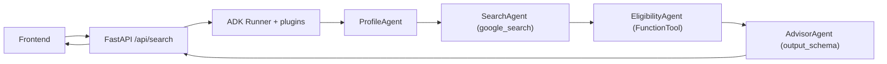

# SCHOLY AGENT

A **multi-agent** system built with the **Google Agent Development Kit (ADK)**
that helps students find the university scholarships that best match their
profile (academic level, field, country, language, nationality, and finances),
and explains the **financial fit** of each option.

Final project of the *5-Day AI Agents Intensive Course with Google*.

---

## 1. The problem

Searching for scholarships is slow, confusing, and scattered: information is
spread across hundreds of sites, with different requirements (level, language,
nationality, GPA) and, most importantly, **a scholarship you "find" is not always
viable**: many cover only tuition and leave out housing, food, and transport in
another country.

## 2. The solution and why agents

A single prompt does not solve a task with several heterogeneous stages well
(understand the user → search the web → filter by rules → advise). A **team of
specialized agents** does: each one does one thing well, is maintainable and
auditable. SCHOLY uses four agents in a sequential pipeline:

| Agent | What it does |
| --- | --- |
| **ProfileAgent** | Normalizes and validates the student's profile. |
| **SearchAgent** | Finds real scholarships on the web with `google_search` (grounding). |
| **EligibilityAgent** | Filters by eligibility and scores with a deterministic tool. |
| **AdvisorAgent** | Delivers the final recommendation + financial analysis (structured JSON). |

## 3. Architecture



State flows between agents via `output_key` → `{key}`:
`student_profile` → `raw_scholarships` → `eligible_scholarships` → `final_recommendation`.

Full details in [docs/architecture.md](docs/architecture.md).

## 4. Project structure

```
scholy-agent/
├─ scholy/                  # Multi-agent system package (ADK)
│  ├─ agent.py              # root_agent (SequentialAgent) -> ADK entrypoint
│  ├─ config.py             # Configuration from environment (zero secrets in code)
│  ├─ llm.py                # Gemini model factory (shared)
│  ├─ schemas.py            # pydantic models (StudentProfile, Scholarship, Recommendation)
│  ├─ observability.py      # Logging + metrics plugins (Agent Ops)
│  ├─ agents/               # ProfileAgent, SearchAgent, EligibilityAgent, AdvisorAgent
│  ├─ tools/                # Compatibility FunctionTool + MCP connector (V2)
│  └─ security/             # Deterministic guardrails + SecurityGuardrailPlugin
├─ server/main.py           # FastAPI backend (API + serves the frontend)
├─ frontend/                # Minimalist UI (HTML + Tailwind CDN + vanilla JS)
├─ docs/architecture.md     # Diagrams and design decisions
├─ AGENTS.md                # System constitution / harness
├─ requirements.txt
├─ .env.example             # Variables template (copy to .env)
└─ .gitignore
```

## 5. Setup (local, free)

Requirements: Python 3.11+ and a free Google AI Studio API key.

```bash
# 1. Virtual environment
python -m venv .venv
.venv\Scripts\activate          # Windows (PowerShell)
# source .venv/bin/activate      # macOS / Linux

# 2. Dependencies
pip install -r requirements.txt

# 3. Credentials
copy .env.example .env           # Windows  (cp on macOS/Linux)
# Edit .env and paste your GOOGLE_API_KEY  (https://aistudio.google.com/apikey)
```

> The MVP runs **100% free** on the Gemini free tier. `google_search` (grounding)
> works within that tier, subject to quota limits.

## 6. Run

**Option A - Web application (recommended):**

```bash
uvicorn server.main:app --reload --port 8000
# Open http://localhost:8000
```

**Option B - ADK development UI (useful to inspect traces in the demo):**

```bash
adk web            # run it in the folder that contains the "scholy" package
# adk web --log_level DEBUG   # to inspect spans/tokens in the Events tab
```

## 7. Security

- **Zero API keys in code.** Every secret lives in `.env` (git-ignored).
  Never commit your `.env`.
- **Anti prompt-injection (2 layers):** deterministic guardrails
  ([scholy/security/guardrails.py](scholy/security/guardrails.py)) + a plugin that
  inspects requests to the model
  ([scholy/security/plugins.py](scholy/security/plugins.py)).
- **Defensive instructions** in every agent (input = data, not commands).
- **Anti-XSS** in the frontend (all agent output is escaped).
- **PII minimization** in the logs.
- *Production:* GCP **Model Armor** as an extra layer (requires billing).

## 8. Observability

`LoggingPlugin` (ADK) + a custom `CountInvocationPlugin` record executed agents
and model calls in `scholy.log`. See [scholy/observability.py](scholy/observability.py).

## 9. Deployment (documented)

> **Important:** this project was developed **without GCP billing**. Cloud Run and
> Vertex AI Agent Engine **require billing**, so the MVP runs locally. The rubric
> does not require deployment; below is the reproducible guide.

Deployment on **Cloud Run** (when billing is available):

```bash
# 1. Package the backend in a container (FastAPI + uvicorn).
#    Make sure you have a Dockerfile that runs:
#      uvicorn server.main:app --host 0.0.0.0 --port $PORT
gcloud run deploy scholy-agent \
  --source . \
  --region us-central1 \
  --allow-unauthenticated \
  --set-secrets "GOOGLE_API_KEY=GOOGLE_API_KEY:latest"
```

- The `GOOGLE_API_KEY` is injected from **Secret Manager**, never from the code.
- Native ADK alternative: `adk deploy cloud_run` (also requires billing).

## 10. Roadmap (V2)

- **Application coach**: steps, deadlines, and essay review.
- **External search via MCP**: enable `tools/search_mcp.py` with an MCP server
  (e.g. Tavily/Serper) for more structured results.
- **LM-as-a-Judge evaluation** over a golden dataset of profiles.
