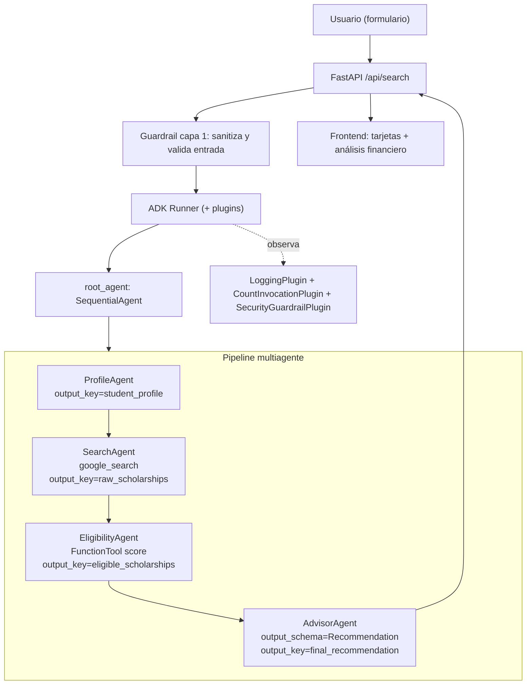

# Arquitectura de SCHOLY AGENT

## Visión general

SCHOLY es un sistema **multiagente** (ADK) con patrón **Sequential** (línea de
ensamblaje). Cada agente es un especialista pequeño; la salida de uno alimenta al
siguiente a través del estado de la sesión.



## Flujo de datos (estado de sesión)

```
ProfileAgent     -> student_profile
SearchAgent      -> raw_scholarships
EligibilityAgent -> eligible_scholarships
AdvisorAgent     -> final_recommendation  (JSON validado contra Recommendation)
```

Las instrucciones de cada agente leen el estado anterior con placeholders, por
ejemplo `{student_profile}` y `{raw_scholarships}`.

## Decisiones de diseño

- **Sequential, no un súper-agente.** El flujo es lineal y cada paso es testeable
  y mantenible por separado (equipo de especialistas).
- **Lógica crítica determinista.** El puntaje de compatibilidad vive en una
  FunctionTool (`compute_compatibility_score`), no en la "intuición" del LLM:
  resultados reproducibles y auditables.
- **Salida estructurada.** El AdvisorAgent usa `output_schema=Recommendation`,
  lo que da a la UI un contrato de datos confiable.
- **Búsqueda híbrida.** Por defecto `google_search` (gratis); el conector MCP
  externo (`tools/search_mcp.py`) queda preparado para V2.

## Seguridad (defense-in-depth)

1. **Guardrails deterministas** (`security/guardrails.py`): sanitización + detección
   de patrones de inyección antes de llamar al modelo.
2. **Instrucciones defensivas** en cada agente (input = datos, no órdenes).
3. **SecurityGuardrailPlugin** (`security/plugins.py`): inspecciona cada petición
   al modelo y deja traza auditable.
4. **Cero API keys en código**: `.env` + `.gitignore`.
5. **Anti-XSS en el frontend**: todo dato del agente se escapa antes de pintarse.
6. *(Producción)* **Model Armor** de GCP como capa adicional (requiere facturación;
   documentado, no implementado en el MVP).

## Observabilidad (Agent Ops)

- `LoggingPlugin` (ADK) + `CountInvocationPlugin` propio cuentan agentes y llamadas
  al modelo (útil para detectar costos inesperados).
- En desarrollo: `adk web --log_level DEBUG` muestra traces (spans `call_llm`,
  `execute_tool`, tokens y tiempos) en la pestaña *Events*.

## Mapeo con los conceptos del curso

| Concepto | Dónde |
| --- | --- |
| Multi-agent system (ADK) | `scholy/agent.py` + `scholy/agents/*` |
| MCP Server | `scholy/tools/search_mcp.py` (camino V2) |
| Security features | `scholy/security/*`, `.env`/`.gitignore`, anti-XSS |
| Agent Skills / herramientas | `scholy/tools/scholarship_tools.py`, `google_search` |
| Observabilidad | `scholy/observability.py` |
| Deployability | sección de despliegue del README |
```
